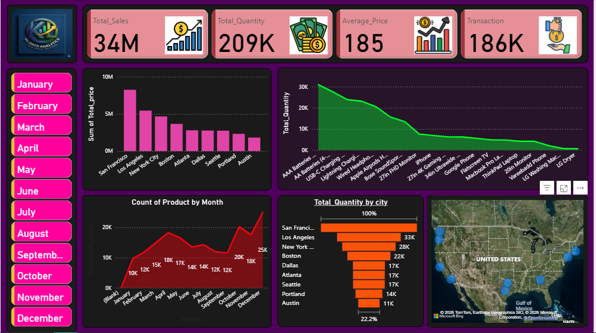

#  Sales Performance Dashboard (Power BI)

## Overview

This project analyzes sales data to uncover key business insights related to product performance, regional sales trends, and monthly demand patterns. An interactive Power BI dashboard was developed to support data-driven decision-making.

---

## Dataset

* Type: Sales dataset
* Records: 10,000+ rows
* Features: Order Date, Product, City, Quantity, Sales

---

## Tools & Technologies

* Power BI
* Data Cleaning & Transformation
* Data Visualization Techniques

---

## Dashboard Features

* **Month Slicer** to filter data dynamically
* **Total Sales by City** (Column Chart) to compare regional performance
* **Total Quantity by Product** to identify top-selling items
* **Monthly Product Trends** (Line Chart) to track demand over time
* **Sales Distribution by City** (Funnel Chart) for performance comparison
* **Geographical Map Visualization** to analyze location-based sales

---

## Key Insights

* Certain cities consistently outperform others in total sales, indicating strong regional demand
* A small number of products contribute significantly to overall sales volume
* Monthly trends reveal seasonal patterns in product demand
* Some regions show lower engagement, suggesting opportunities for business expansion

---

## Dashboard Preview

---

## How to Use

1. Download the `.pbix` file
2. Open using Power BI Desktop
3. Use slicers and filters to explore insights interactively

---

## Skills Demonstrated

* Data Cleaning & Preparation
* Exploratory Data Analysis (EDA)
* Data Visualization & Dashboard Design
* Business Insight Generation
* KPI Analysis

---
